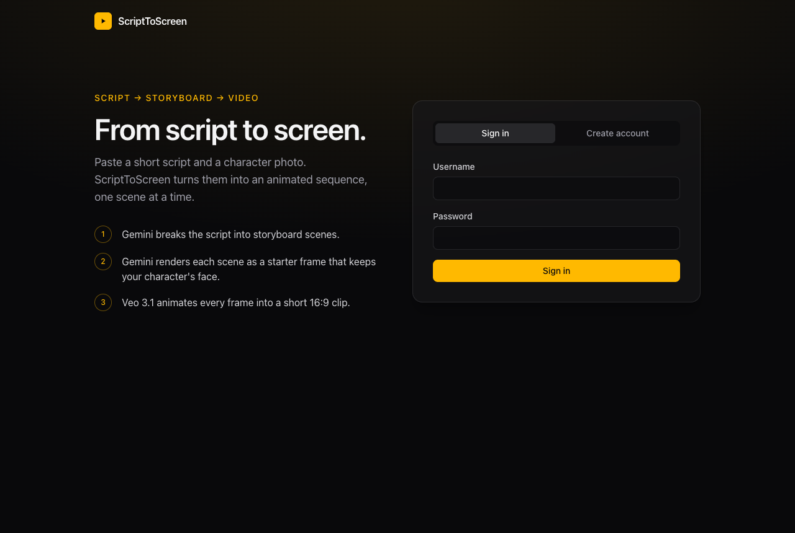
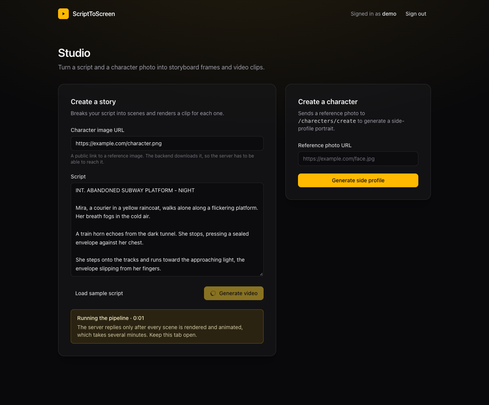
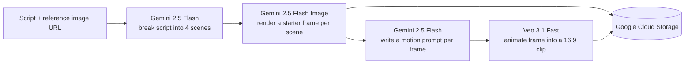

# ScriptToScreen

Turn a short script and a character photo into storyboard frames and animated video clips, using Google Gemini and Veo 3.1.





ScriptToScreen is a full-stack TypeScript app. You sign in, paste a script and a reference image, and the backend breaks the script into four storyboard scenes. It renders each scene from your reference photo, then animates each frame into a short 16:9 clip.

> **Status:** in active development. Generation is implemented, but the web app can't play back the results yet. See [Known limitations](#known-limitations).

## Features

- **Script breakdown:** Gemini splits a script into four scenes, each with a visual prompt, the characters in it, and a caption.
- **Character-consistent frames:** each scene is rendered from your reference image, with a system prompt that asks the model to keep the face consistent.
- **Image-to-video:** Veo 3.1 animates each frame into a 16:9 clip, guided by a motion prompt that Gemini writes.
- **Accounts:** sign up and sign in, with JWT-protected routes. The web app keeps your session across reloads and signs you out when the token expires.
- **Typed throughout:** TypeScript on both sides, Zod validation for the user and story routes, and a Prisma schema for PostgreSQL.

## How it works



Reference images and frames are stored in Google Cloud Storage. Each story run also creates a character record in PostgreSQL. The `POST /stories/create` request stays open until every clip has been generated, which takes several minutes.

## Tech stack

| Layer | Technologies |
| --- | --- |
| Frontend | React 19, TypeScript, Bun (dev server and bundler), TanStack Query, Tailwind CSS v4 |
| Backend | Bun, Express 5, TypeScript, Zod, JWT and bcrypt, Prisma 7 with PostgreSQL |
| AI | Google Gemini 2.5 Flash and Flash Image, Veo 3.1 Fast, via Vertex AI |
| Storage | Google Cloud Storage |
| Tooling | Bun workspaces, Turborepo |

## Repository layout

```
.
├── apps/
│   ├── backend/            Express API, Prisma schema, and the generation pipeline
│   │   ├── routes/         user, story and character routes
│   │   ├── middleware/     JWT authentication
│   │   ├── prisma/         schema and migrations
│   │   ├── config/         system prompts for each model step
│   │   ├── script.ts       Gemini script breakdown
│   │   └── image.ts        Gemini images, Veo video, and Cloud Storage helpers
│   └── frontend/           React app: sign-in and studio (see its README)
├── packages/               shared ESLint and TypeScript configs, plus a UI stub, from the starter
├── docs/                   screenshots used in this README
└── turbo.json
```

## Getting started

### Prerequisites

- [Bun](https://bun.sh) 1.3 or newer (the repo pins 1.3.14)
- A PostgreSQL database
- A Google Cloud project with billing enabled, the Vertex AI and Cloud Storage APIs turned on, and a Cloud Storage bucket. Create a service account that can use Vertex AI and write to the bucket (for example, *Vertex AI User* and *Storage Object Admin*), and download its JSON key.

### 1. Install dependencies

From the repository root:

```bash
bun install
```

### 2. Configure the backend

Copy the template and fill in your values:

```bash
cp apps/backend/.env.example apps/backend/.env
```

Each variable is described in the template. Save the service account key as `apps/backend/gcp-key.json`. The `.env` file and the key are git-ignored, so keep them out of version control. Vertex AI calls use the `us-central1` region.

### 3. Set up the database

```bash
cd apps/backend
bunx prisma migrate deploy
bunx prisma generate
```

`migrate deploy` applies the migrations in `prisma/migrations`. `generate` writes the Prisma client to `generated/prisma`, which is git-ignored, so run it after every fresh clone.

### 4. Start the backend

```bash
cd apps/backend
bun run index.ts
```

The API listens on `http://localhost:4000/api/v1`.

### 5. Start the frontend

In a second terminal:

```bash
cd apps/frontend
bun dev
```

Open the URL Bun prints (`http://localhost:3000` by default), create an account, and open the studio. See [apps/frontend/README.md](apps/frontend/README.md) for frontend details.

### Troubleshooting

- **The backend can't find `generated/prisma`:** run `bunx prisma generate` in `apps/backend`.
- **The web app can't reach the backend:** make sure `bun run index.ts` is running and listening on port 4000.
- **A story or character request returns 500:** the Vertex AI call is probably failing. Check the key path in `GOOGLE_APPLICATION_CREDENTIALS`, the `GCP_PROJECT` ID, and that Vertex AI is enabled for the project.

## API

All routes live under `/api/v1`. Send the token returned by sign-in in the `Authorization` header exactly as returned, with no `Bearer` prefix.

| Method | Route | Auth | Request body | Response |
| --- | --- | --- | --- | --- |
| `POST` | `/users/signup` | None | `name`, `username`, `password` | `201` with the created user |
| `POST` | `/users/signin` | None | `username`, `password` | `200` with `token`, valid for one hour |
| `POST` | `/stories/create` | JWT | `image` (public image URL), `script` | `200` with `{ "message": "Success" }`, sent after the whole pipeline finishes |
| `POST` | `/charecters/create` | JWT | `imageUrl` | Not yet. See [Known limitations](#known-limitations) |

## Known limitations

- **Results can't be played back yet.** The pipeline saves each clip under `uploads/videos/` in your bucket, but no endpoint returns the clips, so the web app can only show that a run has finished.
- **`POST /charecters/create` doesn't reply on success.** It generates a side-profile image and discards it. The web app stops waiting after 30 seconds.
- **Images must be public URLs.** The backend downloads the reference image itself, and there is no upload endpoint.
- **Generation is slow.** A story takes several minutes inside one HTTP request, so keep the browser tab open while it runs.

## Roadmap

- Endpoints that list stories and return playable clip URLs, plus a video player in the studio
- Background jobs with progress updates, instead of one long request
- Direct uploads for reference images

## Acknowledgements

Started from the [Turborepo](https://turborepo.dev) starter (`create-turbo`).
